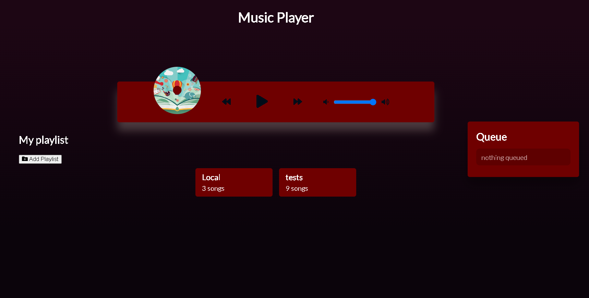
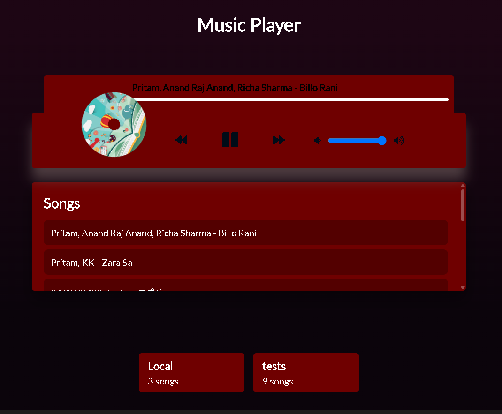
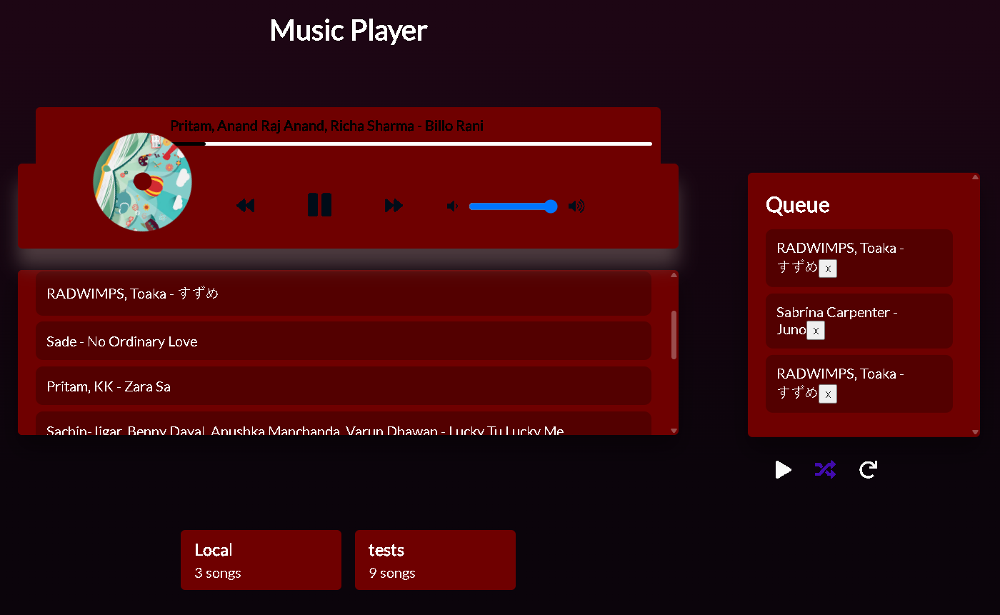

# Music Player

A Dark-red, browser based music player build with HTML ,CSS and javaScript. Play the built-in songs or either load a folder of MP3s from your device as a playlist.

**Live Demo:** https://music-player-nine-roan.vercel.app

 

## Features
-Play, pause, next, previous, a clickable progress bar and a volume slider.
- Spinning album cover while a song is playing.
- **Your own playlists:** pick a folder of MP3s, name it, and it is saved in your browser so its still there after refresh!
- **Shuffle:** reorders the song list you see, and turning it off restores the original orders. (someone says its better than sptify's shuffle)
- **Repeat:** loops the current song
- **Queue:** hover a song and press '+' to add it to the queue panel on the right.
  Queued songs play before the playlsit continues, and you can remove them with 'x'
- Responsive layout for desktop, tablet and Phone
- Custom thin scrollbars to match the theme

## Screenshots

| Player and songs | Queue and shuffle | 
| --- | --- |
|  |  |

## Tech Stack

- HTML5 (including the "audio" element)
- CSS
- JavaScript
- IndexDb for saving playlists in the browser
- File API with a foldder pickere for importing MP3 folders
- [Font Awesome 5.10.2]
- [Lato] font

- ## Getting started
- No installation needed.

  1. **Clone the repo**
  ```bash
   git clone https://github.com/shiziee/Music-player.git
   cd Music-player

Or just use the live demo link

### Adding songs to the built-in "Local" playlist
1. Put your MP3 in the `music/` folder, e.g. `music/hey.mp3`
2. Put a cover image with the same name in `images/`, e.g. `images/hey.jpg`
3. Add the name (without extension) to the `songs` array at the top of `script.js`:
```js
   const songs = ['hey', 'summer', 'ukulele']
```
### Adding your own playlist 
Click **add playlist**, choose a folder that has mp3 files and give it a name. it shows up as a card at the bottom and PLAY!

## Possible future updates
- Show cover art for imported songs (read it from the MP3's metadata)
- Keyboard shortcuts (space to play/pause, arrow keys for next/previous)

